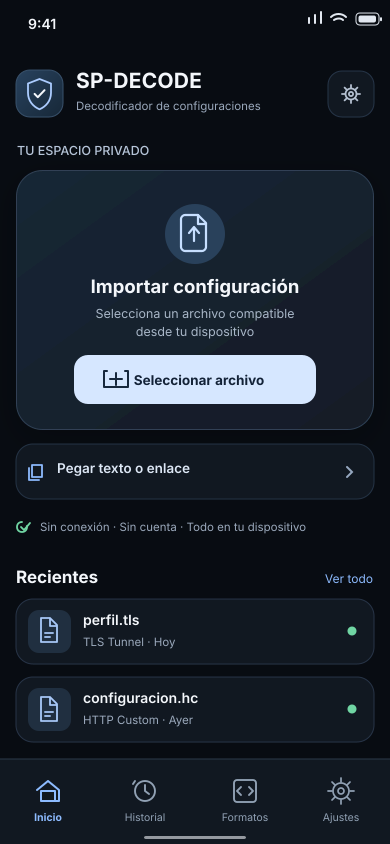
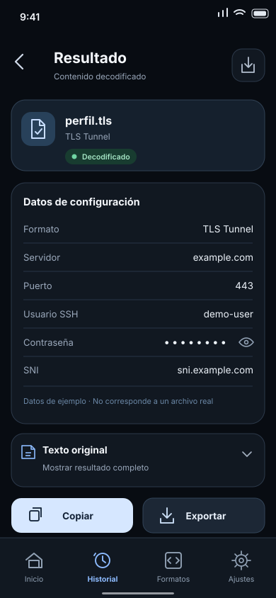

# SP-DECODE Android — documentación oficial

> **Estado:** arquitectura y producto definidos; la aplicación Android NO está implementada ni publicada.
> **Edición:** 1.1 (multidioma), 2026-10-08 · **Repositorio:** Gh0stDeveloper/SP-DECODE · **Branch inicial:** docs/android-offline-architecture
> **Dueño de producto:** Gh0stDeveloper · **Objetivo:** APK nativa, independiente, totalmente local.

## Propósito

Convertir los decodificadores del proyecto SP-DECODE en una aplicación **Android nativa, offline y sin cuentas**, sin eliminar ni alterar el bot de Telegram. Un usuario debe poder instalar la APK, seleccionar un archivo desde la app o el explorador de archivos, obtener una salida legible, conservarla localmente y exportarla **sin depender de conexión, servidor, VPS, Token, Telegram ni Termux**.

La **UI propuesta anteriormente en este proyecto es un requisito de producto**, no un detalle decorativo. El sistema visual, las maquetas SVG y los criterios de aceptación están congelados en [DESIGN_SYSTEM.md](DESIGN_SYSTEM.md); cualquier revisión visual exige decisión explícita y actualización simultánea de maquetas, tokens y pruebas visuales.

## Principios innegociables

1. **Local-only:** sin backend, autenticación, sincronización, telemetría ni permisos de red. El decodificado, la base de datos y los archivos de salida residen en el dispositivo.
2. **Interfaz multidioma:** español, inglés, portugués brasileño y árabe (RTL), sin traducir ni modificar resultados, etiquetas o campos producidos por los decodificadores.
3. **Uso inmediato:** instalación → inicio → importación. Nunca pedir cuenta, token de Telegram ni paso de activación.
4. **Compatibilidad verificable:** no anunciar que un formato funciona por aparecer en el registro. Se requiere fixture, salida comprobada y prueba real en Android.
5. **Privacidad segura:** nunca enviar archivos ni secretos fuera del dispositivo; ocultar credenciales en pantalla y evitar logs, crash reports externos y copias de seguridad sin proteger.
6. **UX premium:** jerarquía visual precisa, superficies neutras, navegación inferior, estados explícitos, animación sutil, accesibilidad y soporte de pantallas compactas.
7. **Independencia del bot:** prohibidas importaciones Android hacia spdecode/handlers, tokens de Telegram, políticas de grupo y polling. El código del bot permanece intacto.
8. **Desarrollo en rama y PR:** implementación aislada, CI obligatoria y cierre solo con criterios de aceptación satisfechos.
9. **Documentación como fuente de verdad:** decisiones, avances, errores y estado de cada formato se actualizan junto con el código.

## Índice y orden de lectura (para cualquier nuevo chat)

1. [PRODUCT_REQUIREMENTS.md](PRODUCT_REQUIREMENTS.md): alcance, historias, flujos, aceptación.
2. [DESIGN_SYSTEM.md](DESIGN_SYSTEM.md): **apariencia visual obligatoria**, medidas, colores, interacciones y pantallas.
3. [LOCALIZATION.md](LOCALIZATION.md): **interfaz es/en/pt-BR/ar, RTL árabe y resultados del decoder sin traducción**.
4. [ARCHITECTURE.md](ARCHITECTURE.md): límites, módulos Android, motor offline y datos.
5. [DECODER_MATRIX.md](DECODER_MATRIX.md): inventario exacto de los 59 sufijos de main y pendientes de pruebas.
   - [DECODER_AUDIT.md](DECODER_AUDIT.md): **auditoría A.2 de los 48 scripts**, riesgos técnicos, recursos y preparación Android.
   - [A2_FIXTURE_POLICY.md](A2_FIXTURE_POLICY.md): muestras seguras, plan de fixtures y pruebas golden por sufijo.
   - [A23_GOLDEN_CORPUS.md](A23_GOLDEN_CORPUS.md): **19 golden cases Linux, 18 sufijos, 41 pendientes**, generadores, hashes y exportador sintético.
   - [audit_decoders.py](audit_decoders.py): herramienta estática de solo lectura, ejecutada en CI.
6. [SECURITY_AND_QA.md](SECURITY_AND_QA.md): privacidad, amenazas, pruebas y reglas de release.
7. [ROADMAP.md](ROADMAP.md): fases A–H, subfases y puertas de calidad.
8. [ADR.md](ADR.md): decisiones técnicas y alternativas descartadas.
9. [HANDOFF.md](HANDOFF.md): procedimiento y prompt para continuar en un chat nuevo.
10. [status.json](status.json): estado legible por máquinas, no sustituye la revisión del CI.

## Fuente y alcance observados el 2026-10-08

- Repositorio público: https://github.com/Gh0stDeveloper/SP-DECODE
- Rama base: main; SHA de referencia: 37965a3a349f38dc05560449bfe56dcd44b348ac.
- decoders.json: 59 sufijos registrados, 48 rutas Python, 8 Node.js, 3 PHP; **39 scripts Python distintos, 6 JS, 3 PHP = 48 scripts**.
- Algunos sufijos comparten script; .sksrv.png es una extensión compuesta. El lector debe usar coincidencia **más larga primero** y normalización Unicode.
- El bot ejecuta scripts externos mediante spdecode/executor.py, una técnica no trasladable literalmente a Android.
- El README actual advierte que los decodificadores legacy aún no están plenamente revalidados con todas las versiones de apps emisoras.
- No existía módulo Android en la rama main al realizar esta revisión. NO existe APK de SP-DECODE Android que pueda presentarse como lista.
- Las pruebas Python existentes son una base, pero no equivalen a certificación de Android, ni validan todos los formatos.

## Alcance v1.0 estable

**Incluye:** importación SAF, ACTION_VIEW/ACTION_SEND, detección de formatos, ejecución local, mensajes de error claros, pantalla de resultados con tarjetas y texto bruto, copiar/compartir/exportar, historial local cifrado, búsquedas/favoritos, configuración, accesibilidad, APK/AAB firmados con CI y pruebas de modo avión. Objetivo de cobertura: **59/59 sufijos con fixtures verificados o informe transparente de incompatibilidades**. No etiquetar 1.0 «compatibilidad total» mientras falten pruebas.

**No incluye:** Telegram embebido, permisos de internet, cuenta, proveedor cloud, VPN de conexión, VPS, integración social, marketplace, anuncios, ejecución de scripts remotos, jailbreak/root, extracción forense ni captura de datos de apps de terceros. La app procesa archivos aportados por el usuario.

**Versionado sugerido:** 0.1.0-alpha (shell/UI e import), 0.2.0-alpha (motor), 0.3.0-beta (formatos), 0.9.0-rc (certificación), 1.0.0 (release gates). La numeración se valida con Gradle antes de adoptarse.

## Verificación documental automática

Ejecutar: python docs/android/validate_docs.py. La prueba revisa presencia y enlaces internos, XML de los SVG, 59 filas de compatibilidad y sincronización de conteos con decoders.json. **No prueba compatibilidad Android real**.

## Resguardo del diseño

Los archivos [design/home-dark.svg](design/home-dark.svg) y [design/result-dark.svg](design/result-dark.svg) conservan **maquetas visuales editables** para el desarrollo de Compose, además de los valores exactos de color, tipografía, espaciado, navegación, tarjetas y estados en DESIGN_SYSTEM.md. Son referencias de diseño, **NO capturas de una app funcional**. Conservarlos en el repositorio asegura continuidad entre chats.

## Auditoría de decodificadores — Fase A.2

La auditoría A.2.1/A.2.2 cubrió estáticamente 48 scripts/59 sufijos. En A.2.3 se construyeron **19 casos golden sintéticos completos para 18 sufijos** (.tls, .v2, .ehil, .ssc, .dark, .ht, .htb, .hc y diez sufijos adicionales; ver corpus), con pruebas de CLI, negativos y hashes. **41/59 sufijos siguen sin fixture positivo**, y **0/59 están verificados en Android**. El corpus se describe en [A23_GOLDEN_CORPUS.md](A23_GOLDEN_CORPUS.md); los riesgos técnicos están en [DECODER_AUDIT.md](DECODER_AUDIT.md). Ningún fixture sintético equivale a compatibilidad probada con versiones actuales de apps externas.

## Estado de entrega

Esta documentación constituye **la especificación inicial del producto**. La implementación, ejecución en dispositivos, validación de dependencias ARM/16 KB, pruebas de descifrado y firma de APK quedan pendientes. Antes de escribir código, leer el registro de decisiones y las puertas de calidad de ROADMAP.md.

